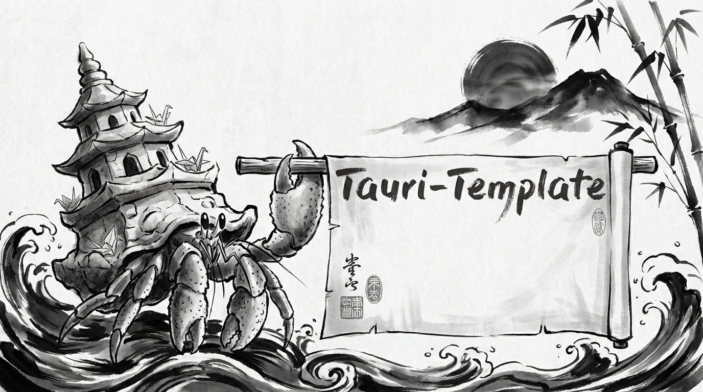

# SealGate

<p align="center">
  
</p>

<p align="center">
<b>Command-line interface for SealGate, the agentic data firewall</b>
</p>

<p align="center">
  <a href="#key-features">Key Features</a> •
  <a href="#architecture">Architecture</a> •
  <a href="#quick-start">Quick Start</a> •
  <a href="#configuration">Configuration</a> •
  <a href="#agent-skills">Agent Skills</a> •
  <a href="#credits">Credits</a>
</p>

<p align="center">
  
  
  
</p>

---

## Key Features

`sealg` is a thin MCP client to the SealGate gateway: `list` and `call` forward
`tools/list` / `tools/call` to the per-user gateway endpoint, where all policy
and enforcement live.

| Feature | Tech Stack |
|---------|:----------:|
| **Core** | `engine` crate - env-resolved gateway config + hand-rolled MCP client (no transport deps) |
| **CLI** | `sealg` binary - `list` / `call` / `doctor` |
| **Transport** | MCP Streamable HTTP to the gateway's `/mcp/{api_key}/` endpoint |
| **Config** | `app-config` crate (YAML + `APP__` env overrides + sanitizer) |
| **Logging** | `tracing` + redaction layer |
| **Packaging** | `cargo-dist` (binaries + installers) |
| **Package Manager** | Bun |
| **Formatting** | Biome + `cargo fmt` |

## Architecture

```
        ┌──────────────────────────────────────────────────────────┐
        │  TRANSPORT  (crates/cli - one binary `sealg`)            │
        │                                                          │
        │   sealg list                         tools/list          │
        │   sealg call <tool> --args '{...}'   tools/call          │
        │   sealg doctor                       local env facts     │
        └───────────────────────────┬──────────────────────────────┘
                                    │  engine::gateway (MCP over HTTP)
        ┌───────────────────────────▼──────────────────────────────┐
        │  crates/engine  - the service core (no transport deps)   │
        │    GatewayConfig  - coordinates resolved from the env    │
        │    GatewayClient  - initialize / tools/list / tools/call │
        │    doctor / types - env facts + stable result contract   │
        └───────────────────────────┬──────────────────────────────┘
                                    │  HTTPS
        ┌───────────────────────────▼──────────────────────────────┐
        │  SealGate gateway  - per-user MCP endpoint; owns ALL     │
        │  policy, trifecta, and PII enforcement                   │
        └──────────────────────────────────────────────────────────┘
```

- `crates/engine/` - the gateway client + config, `doctor` env facts, and the
  shared result contract. No transport dependency.
- `crates/cli/` - the `sealg` binary. The `cli` surface (`doctor`) is a cargo
  feature.
- `crates/config/` - `AppConfig` (with secrets) vs the sanitized
  `FrontendConfig`. The sanitizer is a security boundary.
- `crates/assetgen/` - `asset-gen` binary for `make banner` / `make logo`.

## Quick Start

```bash
# 1. Build + test the workspace
cargo build --workspace
cargo test --workspace

# 2. Point at a gateway and drive it (coordinates come from the environment)
export SEALGATE_URL=http://localhost:3000
cargo run -p sealg -- list
cargo run -p sealg -- call some_tool --args '{"query": "hello"}'

# ...or override the gateway per-invocation
cargo run -p sealg -- list --gateway-url https://dashboard.sealgate.ai
```

## Configuration

Configuration is handled in Rust.

- `app_config::get_config()` (full) / `app_config::get_frontend_config()` (sanitized).

### Environment Variables
Prefix variables with `APP__` to override YAML settings (e.g.,
`APP__MODEL_NAME=gpt-4`). Point a deployed binary at its config file with
`APP_CONFIG_PATH`.

## Agent Skills

Claude Code skills live in `.claude/skills/`. Invoke them with `/skill-name`
(run `/onboarding`, `/update-backend`, `/code-quality`, `/cleanup`, and more).

## Credits

This software uses the following tools:
- [Bun](https://bun.sh/)
- [Biome](https://biomejs.dev/)
- [Rust](https://www.rust-lang.org/)

## About the Core Contributors

<a href="https://github.com/Edison-Watch/cli/graphs/contributors">
  
</a>

Made with [contrib.rocks](https://contrib.rocks).
