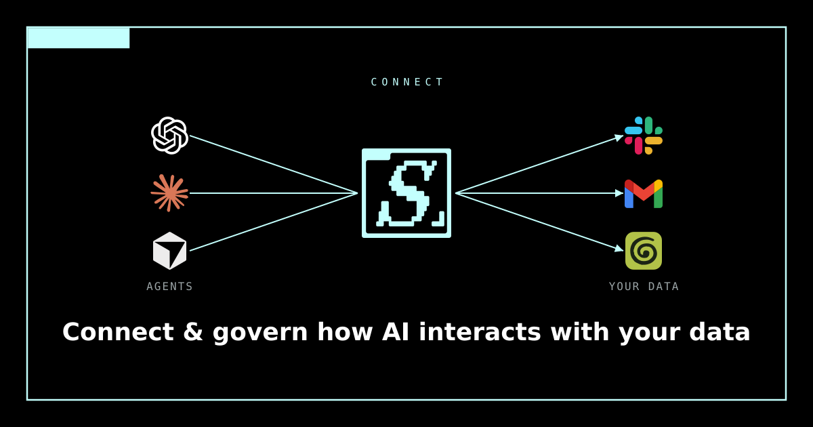
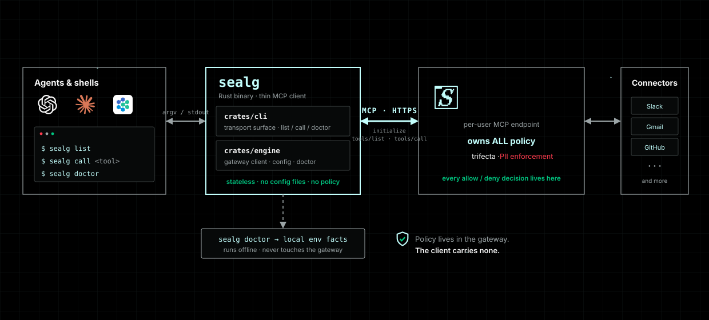
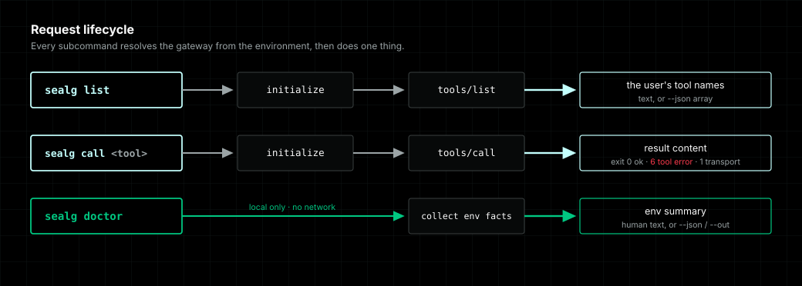

<p align="center">
  
</p>

<h1 align="center">sealg</h1>

<p align="center">
  
  
  
</p>

 The command-line
interface for [SealGate](https://sealgate.ai), the agentic data firewall. `sealg`
is a thin MCP (Model Context Protocol) client to the SealGate **gateway**: `list`
and `call` forward `tools/list` / `tools/call` to your per-user gateway endpoint,
where all policy and enforcement live. The binary is **stateless** and resolves
every coordinate from the **environment** (no config files), so it drops into any
sandbox and carries no policy of its own.

### The `sealg` surface

`sealg` is one small binary with three subcommands. `list` and `call` talk to the
live gateway over MCP; `doctor` stays local and reports environment facts.

```bash
export SEALGATE_URL=https://dashboard.sealgate.ai
sealg list                                   # the tools your gateway exposes
sealg call slack_send --args '{"channel": "#eng", "text": "shipped"}'
sealg doctor --json                          # local env facts, no network
```

| Command | What it does |
|---------|--------------|
| `sealg list` | Run the MCP `initialize` handshake, then `tools/list`, and print the tools your gateway exposes. `--json` emits an array of `{name, description}`. |
| `sealg call <tool> --args '{...}'` | Forward one `tools/call` to the gateway with a JSON arguments object, print the result, and exit `0` on success, `6` on a tool error, `1` on a transport failure. |
| `sealg doctor` | Collect local environment facts and emit a summary. Runs offline and never touches the gateway. `--json` / `--out <path>` write machine-readable output. |

Both `list` and `call` accept `--gateway-url <url>` to override `SEALGATE_URL`
for a single invocation. Everything else, including the API key and CA bundle, is
read from the environment (see [Configuration](#configuration)).

## Architecture

<p align="center">
  
</p>

- **`sealg` is a thin client.** It runs the MCP handshake and forwards requests.
  It holds no allow/deny logic, so the trust boundary is the gateway, not the
  binary you drop into a sandbox.
- **The gateway owns everything that matters.** Policy, trifecta classification,
  and PII enforcement run per-user on the gateway before any connector is
  reached. Swapping the client never changes what is allowed.
- **`doctor` is local.** It reads OS, session, and environment facts and prints
  them without opening a connection, so it is safe to run anywhere.

### Request lifecycle

<p align="center">
  
</p>

The workspace splits along the same boundary as the diagram:

- **`crates/engine/`** the service core: `GatewayConfig` (env-resolved
  coordinates), `GatewayClient` (a hand-rolled MCP-over-HTTP client), the
  `doctor` env facts, and the shared result contract. No transport dependency.
- **`crates/cli/`** the `sealg` binary. The `cli` surface (`doctor`) is a cargo
  feature, so the gateway commands build without the diagnostics code.

## Requirements

- Rust 1.75+ and Cargo
- A reachable SealGate gateway (or `SEALGATE_URL=http://localhost:3000` for local
  development)
- [Bun](https://bun.sh/) and [prek](https://github.com/j178/prek) for the
  formatting and pre-commit hooks

## Quick Start

```bash
# 1. Build and test the workspace
cargo build --workspace
cargo test --workspace

# 2. Point at a gateway and drive it (coordinates come from the environment)
export SEALGATE_URL=http://localhost:3000
cargo run -p sealg -- list
cargo run -p sealg -- call some_tool --args '{"query": "hello"}'

# ...or override the gateway per-invocation
cargo run -p sealg -- list --gateway-url https://dashboard.sealgate.ai
```

Before your first contribution, enable the hooks so `cargo fmt`, Clippy, and Biome
run on every commit:

```bash
bun add -g prek && prek install
```

### Python client

A `uvx`-installable Python client exposing the same `sealg` surface lives in
[`python/`](python/) and is published to PyPI:

```bash
uvx sealg doctor
```

It mirrors the Rust binary's commands and exit codes; the two are kept in sync by
`scripts/check_wire_contract.py`. See [`python/README.md`](python/README.md).

## Configuration

`sealg` reads its gateway coordinates once at startup with
`GatewayConfig::from_env` ([`crates/engine/src/gateway/config.rs`](crates/engine/src/gateway/config.rs)).
Nothing is stored on disk.

| Variable | Purpose |
|----------|---------|
| `SEALGATE_URL` | Gateway origin. Defaults to `http://localhost:3000`. The `--gateway-url` flag overrides it per invocation. |
| `SEALGATE_API_KEY` | Optional. Present, it is embedded in the `/mcp/{key}/` path; absent, the path is `/mcp/` and auth is injected by an upstream proxy. |
| `SEALGATE_SECRET_KEY` | Zero-knowledge secret, sent as the `sealgate_secret_key` header. |
| `SEALGATE_CONVERSATION_ID` | Stable conversation id, sent as `x-sealgate-conversation-id`. Falls back to Centaur's `CENTAUR_THREAD_KEY`. |
| `SSL_CERT_FILE` / `REQUESTS_CA_BUNDLE` / `NODE_EXTRA_CA_CERTS` | Extra CA bundle to trust, for MITM inspection. The first one set wins. |

## Agent Skills

Claude Code and Codex skills live in `.claude/skills/`. Invoke them with
`/skill-name`: run `/onboarding`, `/update-backend`, `/code-quality`,
`/cleanup`, and more. Making backend changes? Start with the `update-backend`
skill for architecture details, command patterns, and `sealg` testing workflows.

## Credits

This software uses the following tools:
- [Bun](https://bun.sh/)
- [Biome](https://biomejs.dev/)
- [Rust](https://www.rust-lang.org/)

## About the Core Contributors

<a href="https://github.com/Edison-Watch/cli/graphs/contributors">
  
</a>

Made with [contrib.rocks](https://contrib.rocks).

## License

See [LICENSE](LICENSE).
